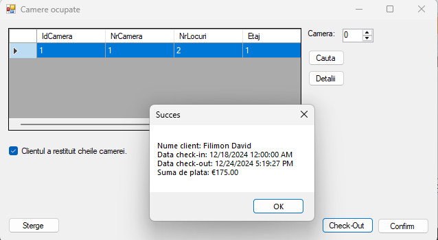

# Hotel Booking Management System - Advanced Programming Technologies

## I. Introduction

**Purpose**: This application manages hotel room bookings, automating the client registration process, check-out workflow, calculating final pricing and duration of stay.

### Technologies Used:

* **Programming Language**: C#
* **IDE**: Visual Studio
* **UI Controls**: DateTimePicker, Button, NumericUpDown, TextField
* **Database**: Microsoft Access
* **Connection**: OleDB
* **Validations**:

  * Admin login (username/password)
  * Mandatory registration fields
  * Valid input values
  * Booking content must reference existing clients
  * Reservation and content tables share the same ID

---

## II. Application Structure

### 1. Entities:

* **Clients**: IdClient, NumeClient, NrTelefon
* **Rooms**: IdCamera, NrCamera, NrLocuri, Etaj, PretZi, SpImagine
* **Bookings**: IdRezervare, DataRezervarii, IdClient
* **BookingContent**: IdRezervare, Nrc, IdCamera, DataCazarii, PretZi, NrZile
* **CompletedBookings**: IdRezervare, Plata, NrZile, NumeClient, DataCheckIn

### 2. Relationships:

* Each booking is linked to a client
* Each booking content must include a rented room
* Each booking content references a valid booking
* Each completed booking corresponds to a previous booking

---

## III. Interfaces and Forms

### 1. Login Form

Form for administrator authentication, displaying app title and author.

### 2. Main Page Form

Displays available rooms, buttons to view occupied rooms, initiate booking, search by floor/occupancy, and refresh view.

### 3. Booking Registration Form

Used to register a client and booking, specifying check-in date and number of days.

### 4. Room Management Form

View and manage booked rooms, search by room number, check-out clients, and view client details.

---

## IV. Implemented Features & Validations

### 1. UI Controls:

* **DateTimePicker**: for selecting reservation start date
* **PictureBox**: to display room images
* **DataGridView**: for displaying room data
* **NumericUpDown**: for room search by foreign keys
* **TextField**: for client/booking input

### 2. Key Validations:

* Numeric fields must follow correct format
* All fields must be filled on form submission
* Deletion actions require confirmation and integrity checks
* Errors displayed if user attempts invalid operations:

  * Wrong login credentials
  * Incomplete form fields
  * Attempting to view details for non-booked rooms
 

### 3. Checkout Summary:

At checkout, a summary is shown with total payment and duration.

---

## V. State Diagrams

### 1. Client States:

* **Unregistered**: not in database
* **Registered**: exists in database
* **Checked-In**: has active reservation
* **Checked-Out**: completed stay

### 2. Booking States:

* **Initialized**: created, pending client registration
* **Confirmed**: linked to client
* **Active**: visible in occupied rooms
* **Completed**: removed post check-out
* **Cancelled**: removed without check-out

### 3. Room States:

* **Available**: listed for reservation
* **Reserved**: shown in occupied list

---

## VI. Design Patterns Used

* **Mediator**: Booking and OccupiedRooms forms interact only via Main form
* **Composite**: Form flow structured hierarchically
* **Singleton**: Classes like DB access instantiated once for global use

---

## Bibliography

* [Refactoring.Guru Design Patterns Catalog](https://refactoring.guru/design-patterns/catalog)
